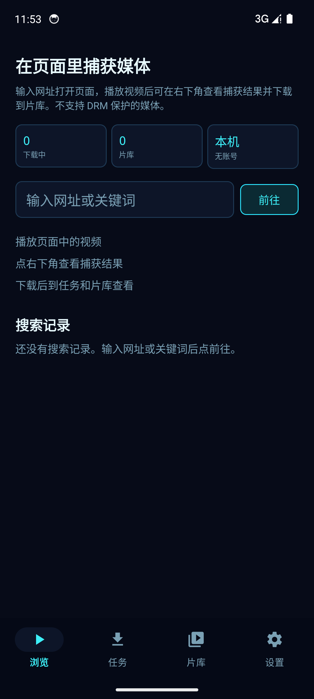
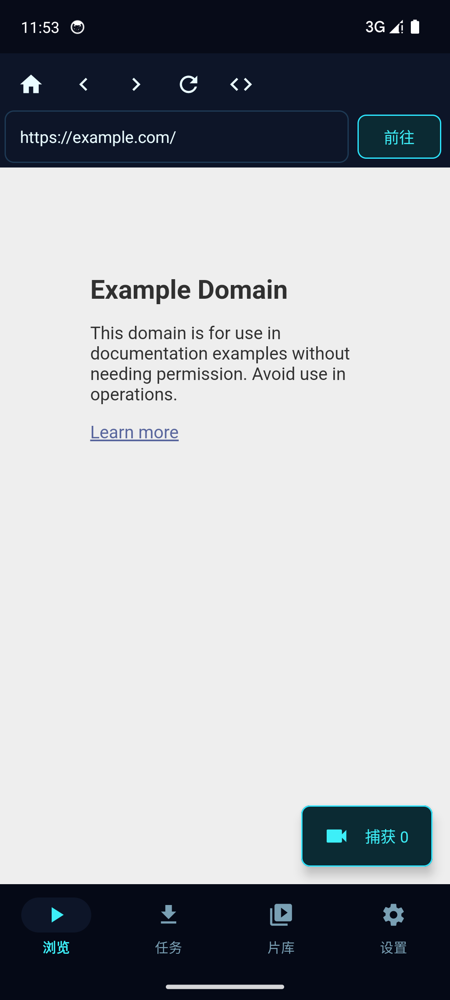
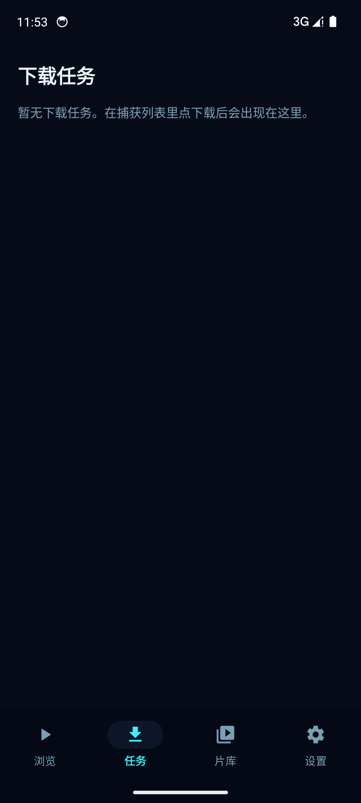

<div align="center">

# Capture

本机优先的 Android 网页媒体捕获工具

在内置浏览器里打开你已经能看的页面，检测并下载其中的非 DRM 媒体。全部在本机完成，没有账号、没有分析、没有广告。

[](https://github.com/wenhaoyu05/WebMediaCapture/releases/latest)
[](https://github.com/wenhaoyu05/WebMediaCapture/releases)
[](https://developer.android.com/tools/releases/platforms)
[](LICENSE)

</div>

## 截图

<p>
  
  
  
</p>

## 功能

- 内置 WebView 浏览，地址栏支持网址、关键词和抖音分享口令 / 短链
- 从页面网络请求、Service Worker 和 DOM 探测捕获 HLS / DASH / 直链
- 粘贴抖音链接后在页面里解析并自动加入下载任务
- 可选 yt-dlp 补充检测，音视频用 FFmpeg 合成 MP4
- 前台下载任务：进度、暂停、继续、取消；失败时显示原因
- 片库内置播放，可分享、导出到相册、重命名、转 MP4；任务和片库显示封面与时长
- 搜索记录仅在点「前往」时写入，不是浏览轨迹
- 深色科技界面，Material 3

## 下载

到 [Releases](https://github.com/wenhaoyu05/WebMediaCapture/releases/latest) 下载最新 APK 并安装。

| 项目 | 说明 |
| --- | --- |
| 当前版本 | [1.2.2](https://github.com/wenhaoyu05/WebMediaCapture/releases/tag/v1.2.2) |
| 系统 | Android 7.0 及以上 |
| 包名 | `com.webmediacapture` |

Google Play 上没有此应用。请从 GitHub 安装，并允许未知来源。

## 使用

1. 输入网址、关键词，或粘贴抖音分享内容，点前往。
2. 普通网页请先播放视频，再点右下角查看捕获结果并下载；抖音链接会自动解析并加入任务。
3. 在「任务」看进度，完成后到「片库」播放、分享或导出。

不支持 DRM。带许可证保护的 HLS / DASH 会被识别并拒绝下载。直播 HLS 只保存当前播放列表窗口。

## 构建

需要 JDK 17 与 Android SDK。

```bash
./gradlew assembleRelease
```

产物位于 `app/build/outputs/apk/release/app-release.apk`。

## 隐私

- 无账号、无分析、无遥测、无广告
- 媒体地址、搜索记录和 Cookie 只留在本机
- `Authorization` 只留在内存；Cookie / Authorization 不写入数据库
- 日志会脱敏；Release 禁止明文流量

## 致谢

检测与下载管线是独立实现。公开资料里参考过 [SurfSave](https://github.com/songsongshuo785-art/SurfSave) 的架构说明，不含其源码。不含 SurfSave 的代理、翻译或画中画播放器。

下载能力还用到了 [yt-dlp](https://github.com/yt-dlp/yt-dlp) 与 FFmpeg。

## 许可证

[GPL-3.0](LICENSE)
